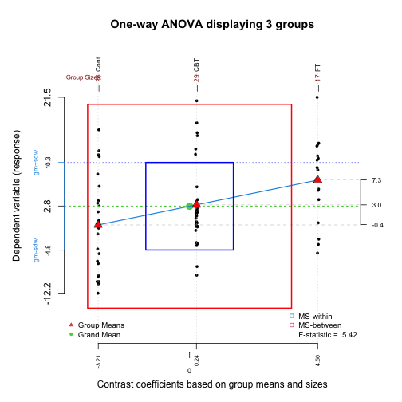

<!-- README.md is generated from README.Rmd. Please edit that file -->


# granova

<!-- badges: start -->
[](https://CRAN.R-project.org/package=granova)
[](https://github.com/fbertran/granova/actions/workflows/R-CMD-check.yaml)
<!-- badges: end -->

This small collection of functions provides what we call elemental graphics for display of analysis of variance results, David C. Hoaglin, Frederick Mosteller and John W. Tukey (1991, ISBN:978-0-471-52735-0), Paul R. Rosenbaum (1989) <doi:10.2307/2684513>, Robert M. Pruzek and James E. Helmreich <https://jse.amstat.org/v17n1/helmreich.html>. 

    The term elemental derives from the fact that each function is aimed at construction of graphical displays that afford direct visualizations of data with respect to the fundamental questions that drive the particular analysis of variance methods. These functions can be particularly helpful for students and non-statistician analysts. But these methods should be quite generally helpful for work-a-day applications of all kinds, as they can help to identify outliers, clusters or patterns, as well as highlight the role of non-linear transformations of data.

## Installation

You can install the released version of granova from [CRAN](https://CRAN.R-project.org) with:


``` r
install.packages("granova")
```

You can install the development version of granova from [github](https://github.com) like so:


``` r
devtools::install_github("fbertran/granova")
```

## Example


``` r
library(granova)
## basic example code
```


``` r
data(arousal)
```

Drug A


``` r
granova.1w(arousal[,1:2], h.rng = 1.6, v.rng = 0.5, top.dot = .35)
```

<div class="figure">

<p class="caption">plot of chunk unnamed-chunk-5</p>
</div>

```
#> $grandsum
#>     Grandmean        df.bet       df.with        MS.bet       MS.with        F.stat 
#>         22.35          1.00         18.00         73.73          6.86         10.75 
#>        F.prob SS.bet/SS.tot 
#>          0.00          0.37 
#> 
#> $stats
#>         Size Contrast Coef Wt'd Mean  Mean Trim'd Mean Var. St. Dev.
#> Placebo   10         -1.92     20.43 20.43       20.30 5.83     2.41
#> Drug.A    10          1.92     24.27 24.27       24.45 7.89     2.81
```

#########################


``` r
data(anorexia, package="MASS")
wt.gain <- anorexia[, 3] - anorexia[, 2]
granova.1w(wt.gain, group = anorexia[, 1], size.line = -3)
```

<div class="figure">

<p class="caption">plot of chunk unnamed-chunk-6</p>
</div>

```
#> $grandsum
#>     Grandmean        df.bet       df.with        MS.bet       MS.with        F.stat 
#>          2.76          2.00         69.00        307.32         56.68          5.42 
#>        F.prob SS.bet/SS.tot 
#>          0.01          0.14 
#> 
#> $stats
#>      Size Contrast Coef Wt'd Mean  Mean Trim'd Mean  Var. St. Dev.
#> Cont   26         -3.21     -0.49 -0.45       -1.16 63.82     7.99
#> CBT    29          0.24      3.63  3.01        1.80 53.41     7.31
#> FT     17          4.50      5.15  7.26        7.91 51.23     7.16
```

##########################


``` r
data(poison)
```

Note violation of constant variance across groups in following graphic.

``` r
granova.1w(poison$SurvTime, group = poison$Group, ylab = "Survival Time")
```

<div class="figure">

<p class="caption">plot of chunk unnamed-chunk-8</p>
</div>

```
#> $grandsum
#>     Grandmean        df.bet       df.with        MS.bet       MS.with        F.stat 
#>          0.48         11.00         36.00          0.20          0.02          9.01 
#>        F.prob SS.bet/SS.tot 
#>          0.00          0.73 
#> 
#> $stats
#>    Size Contrast Coef Wt'd Mean Mean Trim'd Mean Var. St. Dev.
#> 3     4         -0.27      0.21 0.21        0.21 0.00     0.02
#> 9     4         -0.24      0.23 0.23        0.23 0.00     0.01
#> 2     4         -0.16      0.32 0.32        0.32 0.01     0.08
#> 12    4         -0.15      0.32 0.32        0.32 0.00     0.03
#> 6     4         -0.14      0.33 0.33        0.33 0.00     0.05
#> 8     4         -0.10      0.38 0.38        0.38 0.00     0.06
#> 1     4         -0.07      0.41 0.41        0.41 0.00     0.07
#> 7     4          0.09      0.57 0.57        0.57 0.02     0.16
#> 10    4          0.13      0.61 0.61        0.61 0.01     0.11
#> 11    4          0.19      0.67 0.67        0.67 0.07     0.27
#> 5     4          0.34      0.81 0.81        0.81 0.11     0.34
#> 4     4          0.40      0.88 0.88        0.88 0.03     0.16
```

RateSurvTime = SurvTime^-1

``` r
granova.1w(poison$RateSurvTime, group = poison$Group, 
ylab = "Survival Rate = Inverse of Survival Time")
```

<div class="figure">

<p class="caption">plot of chunk unnamed-chunk-9</p>
</div>

```
#> $grandsum
#>     Grandmean        df.bet       df.with        MS.bet       MS.with        F.stat 
#>          2.62         11.00         36.00          5.17          0.24         21.53 
#>        F.prob SS.bet/SS.tot 
#>          0.00          0.87 
#> 
#> $stats
#>    Size Contrast Coef Wt'd Mean Mean Trim'd Mean Var. St. Dev.
#> 4     4         -1.46      1.16 1.16        1.16 0.04     0.20
#> 5     4         -1.23      1.39 1.39        1.39 0.31     0.55
#> 10    4         -0.93      1.69 1.69        1.69 0.13     0.36
#> 11    4         -0.92      1.70 1.70        1.70 0.49     0.70
#> 7     4         -0.76      1.86 1.86        1.86 0.24     0.49
#> 1     4         -0.14      2.49 2.49        2.49 0.25     0.50
#> 8     4          0.09      2.71 2.71        2.71 0.17     0.42
#> 6     4          0.41      3.03 3.03        3.03 0.18     0.42
#> 12    4          0.47      3.09 3.09        3.09 0.06     0.24
#> 2     4          0.65      3.27 3.27        3.27 0.68     0.82
#> 9     4          1.64      4.26 4.26        4.26 0.06     0.23
#> 3     4          2.18      4.80 4.80        4.80 0.28     0.53
```

Nonparametric version: RateSurvTime ranked and rescaled to be comparable to RateSurvTime; note labels as well as residual (rug) plot below.


``` r
granova.1w(poison$RankRateSurvTime, group = poison$Group, 
ylab = "Ranked and Centered Survival Rates",
main = "One-way ANOVA display, poison data (ignoring 2-way set-up)", 
res = TRUE)
```

<div class="figure">

<p class="caption">plot of chunk unnamed-chunk-10</p>
</div>

```
#> $grandsum
#>     Grandmean        df.bet       df.with        MS.bet       MS.with        F.stat 
#>          2.49         11.00         36.00          3.70          0.19         19.18 
#>        F.prob SS.bet/SS.tot 
#>          0.00          0.85 
#> 
#> $stats
#>    Size Contrast Coef Wt'd Mean Mean Trim'd Mean Var. St. Dev.
#> 4     4         -1.38      1.11 1.11        1.11 0.03     0.18
#> 5     4         -1.13      1.36 1.36        1.36 0.28     0.53
#> 10    4         -0.82      1.67 1.67        1.67 0.10     0.31
#> 11    4         -0.80      1.69 1.69        1.69 0.50     0.71
#> 7     4         -0.67      1.81 1.81        1.81 0.24     0.49
#> 1     4         -0.10      2.39 2.39        2.39 0.30     0.55
#> 8     4          0.23      2.72 2.72        2.72 0.19     0.44
#> 6     4          0.55      3.04 3.04        3.04 0.18     0.42
#> 12    4          0.61      3.09 3.09        3.09 0.05     0.22
#> 2     4          0.66      3.15 3.15        3.15 0.39     0.62
#> 9     4          1.29      3.78 3.78        3.78 0.03     0.16
#> 3     4          1.55      4.04 4.04        4.04 0.03     0.16
```

